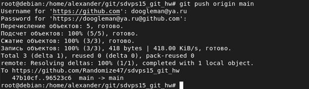

# Домашнее задание к занятию "`Git HW`" - `Макаров Александр`

### Задание 1

1.	Зарегистрируйте аккаунт на https://github.com/.
2.	Создайте публичный репозиторий. Обязательно поставьте галочку Initialize this repository with a README.
3.	Склонируйте репозиторий, используя https протокол (git clone ...).

 4.	Перейдите в каталог с клоном репозитория.

5.	Произведите первоначальную настройку git, указав свое настоящее имя и email (git config --global user.name и git config --global user.email johndoe@example.com).
6.	Выполните команду git status и запомните результат.
 
7.	Отредактируйте файл README.md любым удобным способом, тем самым переведя файл в состояние Modified.
 
8.	Еще раз выполните git status и продолжайте проверять вывод этой команды после каждого последующего шага.
 
9.	Давайте теперь посмотрим изменения в файле README.md, выполнив команды git diff и git diff --staged.
 
10.	Переведите файл в состояние staged (или как говорят просто добавьте файл в коммит) командой git add README.md.
11.	И еще раз выполните команды git diff и git diff --staged.
 
12.	Теперь можно сделать коммит git commit -m 'First commit'.
13.	Сделайте git push origin master.

В качестве ответа на задание добавьте ссылку на этот коммит в ваш md-файл с решением: 
https://github.com/netology-code/sys-pattern-homework/commit/96523c690379366c5c6d5885c8e185618f9972ff

---

### Задание 2

https://github.com/Randomize47/sdvps15_git_hw/commit/331a2d8ff93712b1806b4699faee0cfd27eb0489

### Задание 3

https://github.com/Randomize47/sdvps15_git_hw/network
